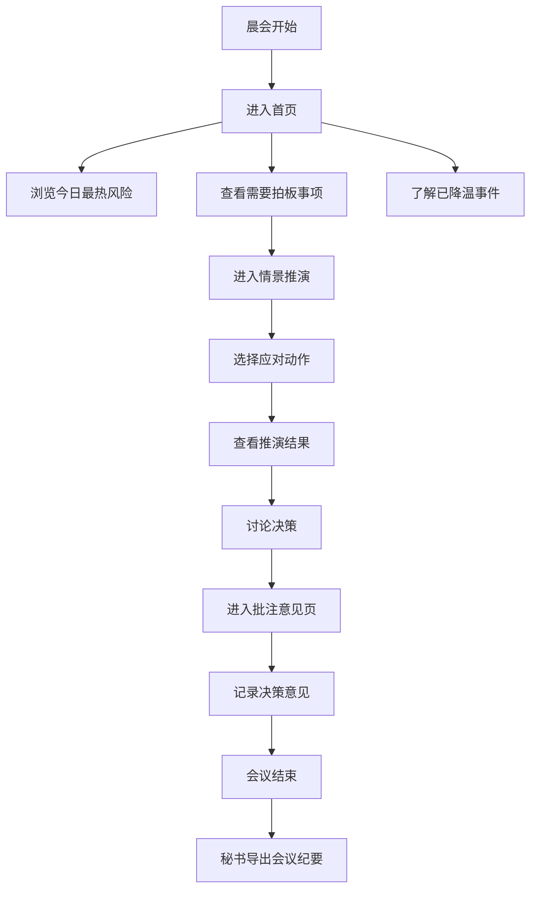

## 1. 产品概述

面向银行、保险、基金公司高管晨会的平板端声誉风险简报器，帮助非舆情专业背景的高管在三分钟内快速掌握当日品牌风险全貌，支持情景推演预判和会议批注决策，提升声誉风险管理效率。

## 2. 核心功能

### 2.1 用户角色

| 角色 | 使用场景 | 核心权限 |
|------|---------|----------|
| 高管（行长/总经理级） | 晨会阅读简报、情景推演、决策拍板 | 查看全部风险事件、推演决策、批注意见 |
| 品牌/公关负责人 | 准备简报材料、记录会议意见 | 维护事件信息、整理批注、导出纪要 |
| 会议秘书 | 会后整理输出 | 导出会议纪要、分发决策事项 |

### 2.2 功能模块

1. **首页总览**：今日最热风险卡片、需要拍板事项卡片、已降温事件卡片
2. **情景推演**：四种应对动作选择（继续沉默、客服解释、官方声明、业务整改），实时展示舆论反应、监管关注概率、客户信任影响
3. **批注意见**：参会人对事件写短指令（同意发布声明、请法务复核、由分行先沟通等），支持导出会议纪要

### 2.3 页面详情

| 页面名称 | 模块名称 | 功能描述 |
|---------|---------|----------|
| 首页 | 顶部栏 | 显示会议日期、机构Logo、天气/股指等晨会氛围信息 |
| 首页 | 今日最热风险卡片 | 红色警示卡片，通俗说明事件、品牌影响、处置进度，可展开详情 |
| 首页 | 需要拍板事项卡片 | 琥珀色提示卡片，列出需高管决策的事项清单，支持一键进入推演 |
| 首页 | 已降温事件卡片 | 绿色状态卡片，展示已妥善处理的事件及后续建议 |
| 情景推演页 | 事件信息区 | 展示当前事件基本情况，可切换不同事件进行推演 |
| 情景推演页 | 动作选择区 | 四个大按钮对应四种应对动作，带图标和简短说明 |
| 情景推演页 | 推演结果区 | 三栏展示：舆论反应趋势、监管关注概率、客户信任度变化，附带专家建议 |
| 批注意见页 | 事件列表 | 左右分栏，左侧事件列表，右侧批注输入区 |
| 批注意见页 | 批注输入 | 快捷指令标签 + 自由文本输入，记录参会人、时间戳 |
| 批注意见页 | 纪要导出 | 一键导出 Word/PDF 格式的会议纪要文件 |

## 3. 核心流程

晨会开始 → 高管打开平板进入首页 → 依次浏览三张卡片了解风险全貌 → 对需要拍板的事项进入情景推演 → 选择动作查看预判结果 → 讨论后在批注意见页记录决策 → 会议结束秘书导出纪要 → 后续跟踪处置进度

## 4. 用户界面设计

### 4.1 设计风格

- **主色调**：深邃藏青色 (#0A2540)，传达金融行业的专业稳重感
- **强调色**：风险红 (#DC2626)、决策琥珀 (#D97706)、安全绿 (#059669)、品牌金 (#C9A962)
- **中性色**：炭灰 (#1F2937)、中灰 (#6B7280)、浅灰 (#F3F4F6)、米白 (#FAFAF9)
- **卡片风格**：圆角16px，柔和阴影，悬浮时轻微浮起动效
- **字体**：标题用思源宋体（庄重感），正文用思源黑体（易读性），数字用等宽字体
- **图标风格**：线性图标，2px线宽，统一描边圆角

### 4.2 页面设计概览

| 页面名称 | 模块名称 | UI元素 |
|---------|---------|--------|
| 首页 | 顶部栏 | 大标题、日期时间、机构标识、装饰线条 |
| 首页 | 风险卡片 | 三列布局，每张卡片有状态色条、图标徽章、标题、通俗描述、进度条、展开按钮 |
| 首页 | 风险卡片-展开 | 滑动展开详情，包含时间线、涉及产品、传播渠道、处置责任人 |
| 情景推演页 | 事件信息 | 顶部事件横幅，事件摘要条，风险等级徽章 |
| 情景推演页 | 动作按钮 | 2×2网格大按钮，图标+文字+说明，选中态高亮发光 |
| 情景推演页 | 推演结果 | 三列数据卡片，每列含趋势小图表、百分比数值、文字说明、专家建议气泡 |
| 批注意见页 | 事件列表 | 侧边列表，选中态左侧色条指示 |
| 批注意见页 | 批注区 | 快捷标签按钮、文本输入框、已显示批注气泡（带人名头像） |
| 批注意见页 | 导出区 | 底部悬浮导出栏，导出格式选择、预览按钮 |

### 4.3 响应式设计

- **设计基准**：平板横屏优先（1280×800 / 1024×768）
- **触控优化**：按钮最小触控区域 56×56px，间距不少于 16px
- **字体缩放**：标题 28-36px，正文 16-18px，确保会议室距离可读
- **布局适配**：小屏平板自动调整为两列或单列堆叠

### 4.4 动效设计

- 页面进入：卡片从上到下错落淡入（staggered fade-in，每张延迟 100ms）
- 卡片悬浮：向上浮动 4px + 阴影加深（transition 0.3s ease）
- 推演选择：选中按钮光圈扩散 + 结果区数字滚动动画（count-up）
- 批注添加：新批注从右侧滑入 + 轻微弹性回弹
