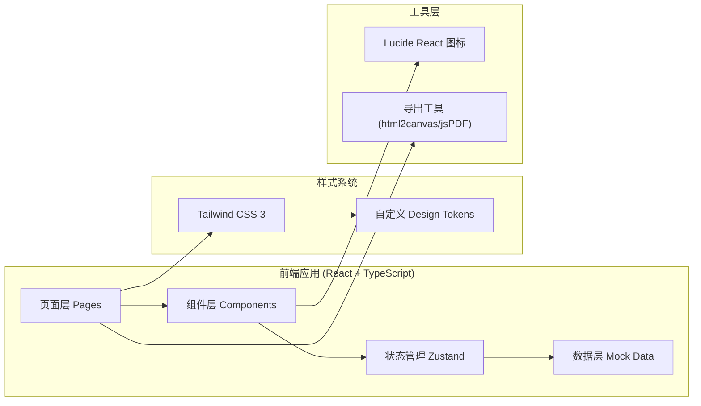

## 1. 架构设计



## 2. 技术选型说明

- **前端框架**：React 18 + TypeScript —— 组件化开发，类型安全，适合企业级应用
- **构建工具**：Vite —— 开发启动快，热更新效率高
- **样式方案**：Tailwind CSS 3 —— 原子化CSS，快速构建一致UI
- **状态管理**：Zustand —— 轻量级状态管理，API简洁，适合中小规模应用
- **图标库**：Lucide React —— 统一风格的线性图标库
- **数据来源**：本地Mock数据 —— 演示用，后续可接入真实舆情API
- **导出功能**：前端导出（jsPDF + html2canvas）—— 无需后端即可生成会议纪要

## 3. 路由定义

| 路由路径 | 页面组件 | 用途说明 |
|---------|---------|----------|
| `/` | `HomePage` | 首页 - 三张风险卡片总览 |
| `/scenario/:eventId` | `ScenarioPage` | 情景推演页 - 选择动作查看预判结果 |
| `/annotations` | `AnnotationsPage` | 批注意见页 - 记录决策、导出纪要 |

## 4. 数据模型定义

### 4.1 核心数据结构

```typescript
// 风险事件等级
type RiskLevel = 'critical' | 'warning' | 'resolved';

// 风险事件
interface RiskEvent {
  id: string;
  title: string;
  level: RiskLevel;
  summary: string;           // 通俗语言说明"发生了什么"
  brandImpact: string;       // 为什么可能影响品牌
  progress: string;          // 现在处置到哪一步
  progressPercent: number;   // 处置进度百分比 0-100
  timeline: TimelineItem[];  // 事件时间线
  products: string[];        // 涉及产品/业务线
  channels: string[];        // 主要传播渠道
  owner: string;             // 处置责任人
  updatedAt: string;         // 最后更新时间
}

// 时间线节点
interface TimelineItem {
  time: string;
  description: string;
}

// 应对动作类型
type ActionType = 'silence' | 'customer_service' | 'official_statement' | 'business_rectification';

// 推演结果
interface ScenarioResult {
  action: ActionType;
  publicReaction: {
    trend: 'positive' | 'neutral' | 'negative';
    description: string;
    sentimentScore: number;   // -100 到 100
  };
  regulatoryRisk: {
    probability: number;      // 0-100 百分比
    description: string;
  };
  customerTrust: {
    impact: 'highly_positive' | 'positive' | 'neutral' | 'negative' | 'highly_negative';
    description: string;
    changePercent: number;    // 变化幅度百分比
  };
  expertAdvice: string;       // 专家建议
}

// 批注意见
interface Annotation {
  id: string;
  eventId: string;
  author: string;             // 参会人姓名
  role: string;               // 职务
  content: string;            // 批注内容
  timestamp: string;          // 批注时间
  category?: 'approval' | 'review' | 'delegation' | 'other';
}

// 快捷批注模板
interface QuickAnnotation {
  id: string;
  label: string;
  category: 'approval' | 'review' | 'delegation' | 'other';
}
```

## 5. 目录结构

```
src/
├── components/              # 可复用组件
│   ├── layout/             # 布局组件
│   │   └── AppHeader.tsx   # 顶部导航栏
│   ├── cards/              # 卡片组件
│   │   ├── RiskCard.tsx    # 风险事件卡片
│   │   ├── CriticalCard.tsx
│   │   ├── PendingCard.tsx
│   │   └── ResolvedCard.tsx
│   ├── scenario/           # 情景推演组件
│   │   ├── ActionSelector.tsx
│   │   ├── ResultPanel.tsx
│   │   └── TrendChart.tsx
│   └── annotations/        # 批注组件
│       ├── EventSidebar.tsx
│       ├── AnnotationInput.tsx
│       └── AnnotationBubble.tsx
├── pages/                  # 页面组件
│   ├── HomePage.tsx
│   ├── ScenarioPage.tsx
│   └── AnnotationsPage.tsx
├── store/                  # Zustand状态管理
│   └── useAppStore.ts
├── data/                   # Mock数据
│   ├── mockEvents.ts
│   ├── mockScenarios.ts
│   └── mockAnnotations.ts
├── types/                  # TypeScript类型定义
│   └── index.ts
├── utils/                  # 工具函数
│   ├── exportMinutes.ts    # 会议纪要导出
│   └── formatters.ts       # 格式化工具
├── App.tsx
├── AppRouter.tsx
├── main.tsx
└── index.css
```
